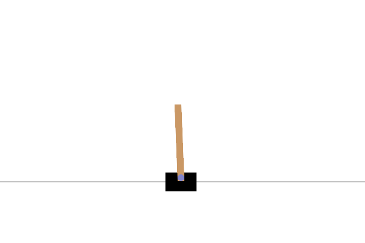

# Deep Q-Learning Agent for classic control games

Hello hello.

If you are reading this you might be a professor or someone interested in Deep Q-Learning. Hence, welcome !

This project has been done in the context of the course Mathematics of machine and deep learning algorithm at the Toulouse School of Economics for the second year of the master Data Science for Social Sciences.

The aim is to explore and implement Deep Q-learning algorithms in reinforcement learning, specifically focusing on MinAtar games. The project will encompass the development of a Deep Q-Learning agent from scratch, training and testing it in different environments (we will try it first in the environment of a CartPole game).

Unfortunately I did not have time to implement a Munchausen Agent to compare its performance to my DQN agent. But the M-DQN Agent is known to be a better one. I might try after the deadline to implement it. 

## Structure

The structure of the repository is the following: 

## Results

The CartPole game is the game bellow. 

*Source: Gymnasium Website*

IMPORTANT SOURCES / HELPS : 

- https://github.com/patrickloeber/snake-ai-pytorch/blob/main/snake_game_human.py + https://www.youtube.com/watch?v=L8ypSXwyBds

- https://www.youtube.com/watch?v=wc-FxNENg9U

- CartPole code: https://github.com/openai/gym/blob/master/gym/envs/classic_control/cartpole.py#L130
