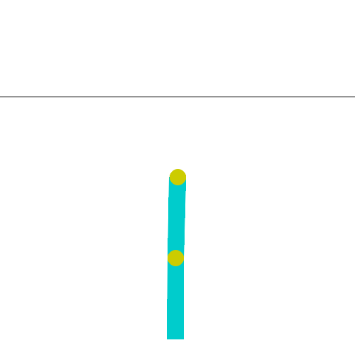
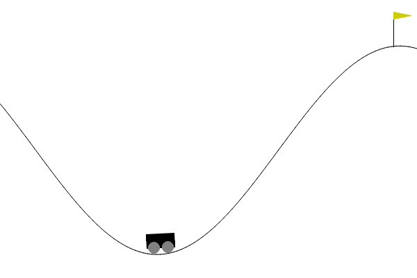

# Deep Q-Learning Agent for classic control games

Hello hello.

If you are reading this you might be a professor or someone interested in Deep Q-Learning. Hence, welcome !

This project has been done in the context of the course Mathematics of machine and deep learning algorithm at the Toulouse School of Economics for the second year of the master Data Science for Social Sciences.

The aim is to explore and implement Deep Q-learning algorithms in reinforcement learning, specifically focusing on MinAtar games. The project will encompass the development of a Deep Q-Learning agent from scratch, training and testing it in different environments (we will try it first in the environment of a CartPole game).

Unfortunately I did not have time to implement a Munchausen Agent to compare its performance to my DQN agent. But the M-DQN Agent is known to be a better one. I might try after the deadline to implement it. 

## Structure

The structure of the repository is the following: 

  - [GIFs](GIFs) and [Plots](Plots) where I stored the GIFs and Plots (makes sense)
  - [Agent](AGENT.py) is the most important file. In it you will be able to see how I created the DQN agent, along with the docstrings in google format for each function and with comments for each ambiguous or complex code section.
  - [Report](REPORT.md) is the final report to be handed out for evaluation. You can find the theoretical parts about Deep Q-Learning and also about Munchausen DQL.

## Results

I tried my DQN Agent in the following games: CartPole, Acrobot and Moutain Car.

#### CartPole

#### Acrobot

#### Mountain car

*Source: Gymnasium Website*

The best results I obtain were on the CartPole game. It might be because when I implemented the agent I was thinking too much about the game I wanted it to perform on. 

The following plot show the main results but you can find more results in the [Plots](Plots) folder where they are named chronologically (first is [1-First try of the dqn agent](Plots/1-First%20try%20of%20the%20dqn%20agent.png) and last one is [11-mountain car](Plots/11-%20mountain%20car.png)).

The final results for the three games are: 

#### CartPole

#### Acrobot

#### MountainCar

## Improvements

As I have to hand out this repository before the deadling I am not going to work more on it before the final evaluation. However, I wish to work more on it.

The next steps are the following: create GIFs of the agent playing games, train it on more games (more complicated) which implies to improve it.

I also would like to implement the Munchausen Agent, so I can compare the two agent. Even if I suspect, after reading the litterature that the M-DQN is much better than the simple DQN. We never know what could happen (in this case, yes we do).

## Sources

You can find all the sources I used at the end of the [Report](REPORT.md) file. 
